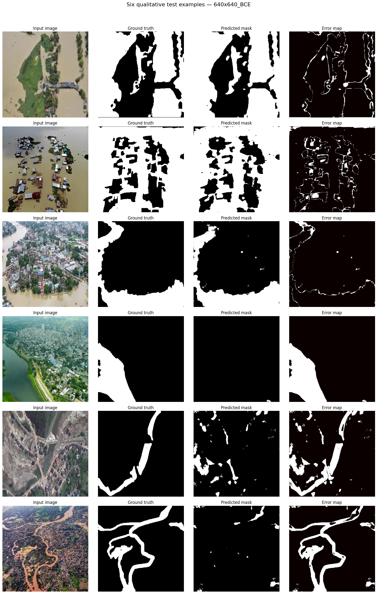

# COMP 9130 Mini Project 8 — Flood Area Segmentation

## Project overview
This project builds a U-Net-based semantic segmentation pipeline to identify flooded vs non-flooded pixels in aerial/UAV imagery.

## Dataset
- **Dataset option:** Flood Area Segmentation
- **Source:** Kaggle (`faizalkarim/flood-area-segmentation`)
- **Task:** Binary semantic segmentation of flood vs background

## Setup instructions

Run this command to install all dependancies 

```bash
pip instal -r requirements.txt
```

dataset is automatically downloaded when runnning the notebook


## Experimental Results
| experiment | IoU_background | IoU_flood | mIoU | Dice_flood |
| --- | --- | --- | --- | --- |
| 256x256_BCE_warmup | 0.0001 | 0.3991 | 0.1996 | 0.5705 |
| 640x640_BCE | 0.8103 | 0.7134 | 0.7619 | 0.8327 |
| 640x640_BCE_Dice | 0.8054 | 0.7066 | 0.756 | 0.8281 |

## Sample prediction visualizations


## Team member contributions
** Vibhor Malik ** - Jupyter notebook, Final report, ReadME, Github
** Brendan Zapf ** - Jupyter notebook, Final report, ReadME, Github

